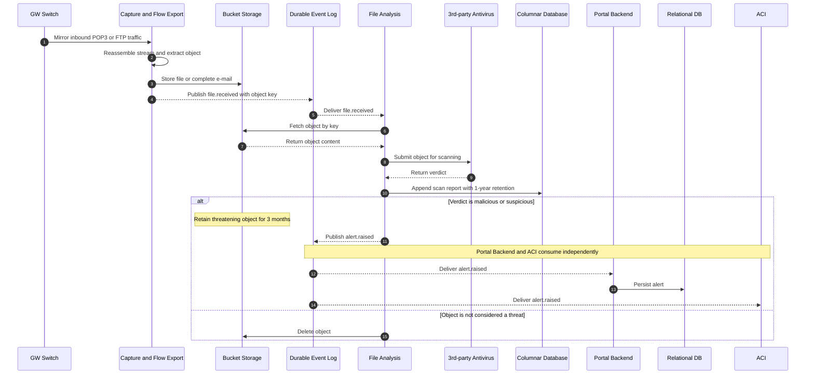
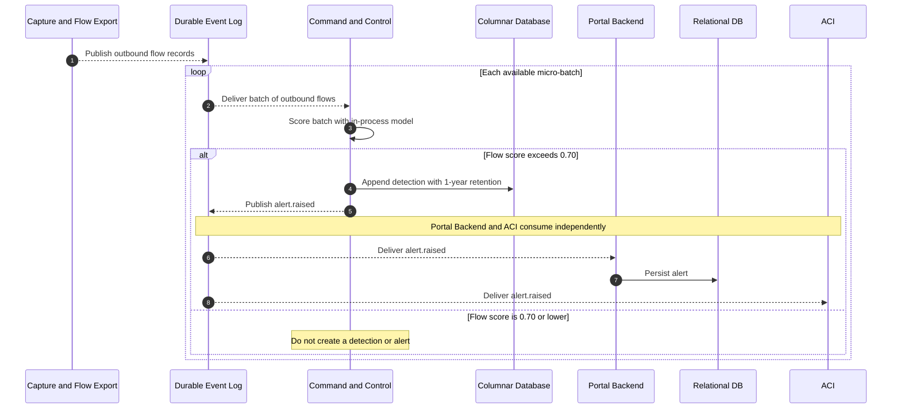
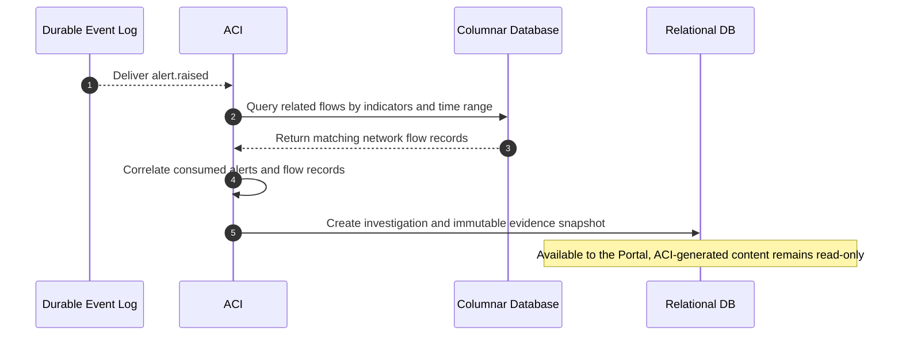
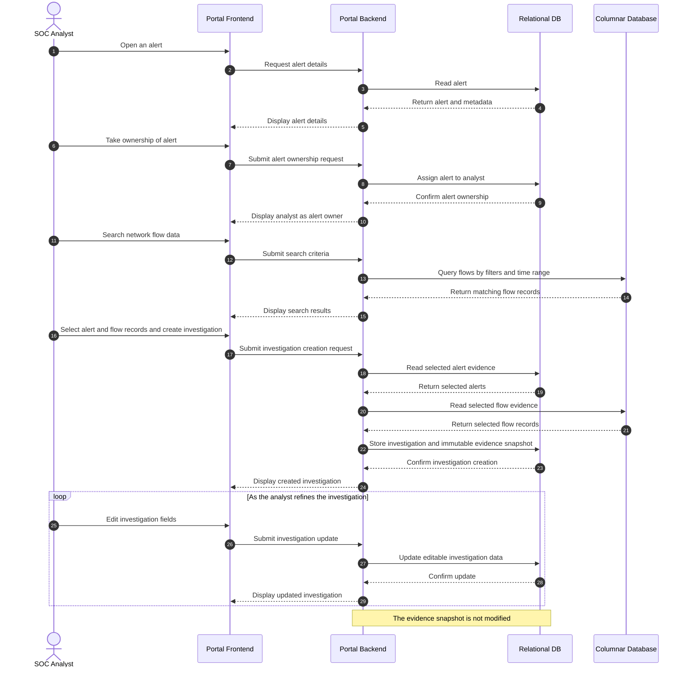
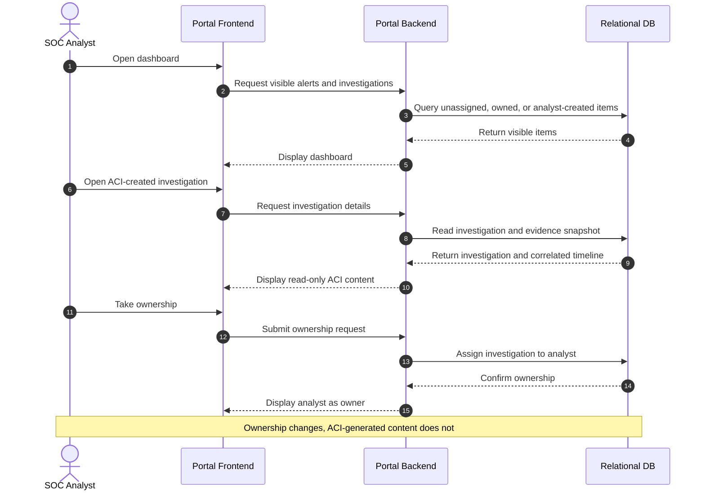
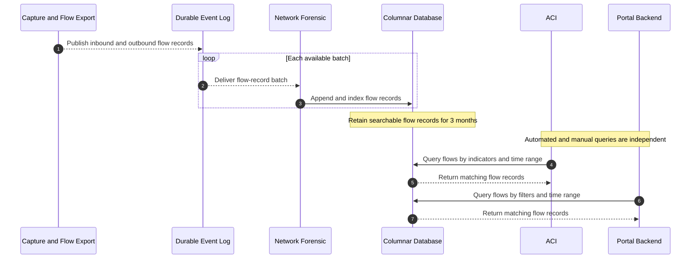

# 3.2 Processes

The following sequence diagrams describe the main runtime processes and the order in which components interact. Dashed arrows represent asynchronous event delivery or returned responses; solid arrows represent direct requests, data writes, or internal processing.

### 3.2.1 File Analysis

Capture & Flow Export reconstructs inbound POP3 and FTP streams, stores each extracted object, and publishes only its reference. File Analysis scans each object immediately and always stores the scan report. Threatening content is retained and raises an alert; other content is deleted (FR-FA-001 through FR-FA-009, ADR-006).

### 3.2.2 Command & Control Detection

Command & Control consumes outbound flow metadata in micro-batches and scores each batch with its in-process machine-learning model. Only flows whose score exceeds 0.70 produce a retained detection and an alert (FR-CC-001 through FR-CC-006, ADR-004).

### 3.2.3 Automatic Investigation Creation

The ACI consumes every raised alert, queries related network flow data, correlates evidence using shared indicators and time proximity, and creates an investigation. The correlated evidence is copied into an immutable snapshot so it remains reviewable after the source flow records expire (FR-ACI-001 through FR-ACI-005, ADR-005).

### 3.2.4 Manual Investigation Creation

A SOC analyst can inspect and take ownership of an alert, search network flow data, and create an investigation from selected evidence. At creation time, the Backend copies the selected alerts and flow records into an immutable evidence snapshot. The analyst can continue editing the investigation they created, while the captured evidence remains frozen (FR-INVP-003/004/005/007/008, ADR-005).

### 3.2.5 Review and Ownership of an Automatic Investigation

An analyst can open an ACI-created investigation, review its correlated timeline and evidence, and take ownership of it. Ownership metadata can change, but the ACI-generated investigation content remains immutable (FR-INVP-002/003/005/006).

### 3.2.6 Network Forensic Ingestion and Query

Network Forensic consumes both inbound and outbound flow records in batches and appends them to the Columnar Database, where they remain indexed and searchable for 3 months. The ACI queries this data for automated correlation, while the Portal Backend queries it for manual investigation (FR-NF-001 through FR-NF-004, FR-ACI-003, FR-INVP-004).

---

← [3.1 System Architecture](3.1-system-architecture.md) · [3.3 Design Rules & Principles →](3.3-design-rules-principles.md)
